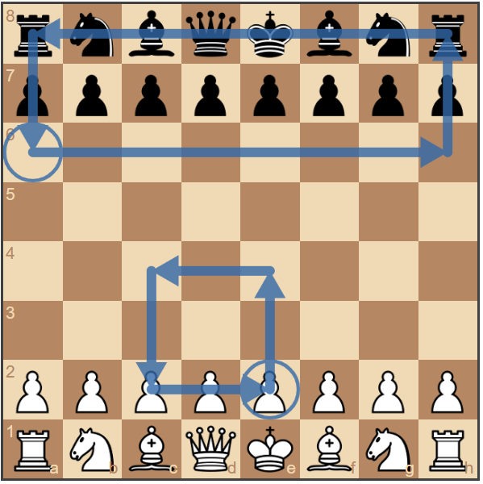

# Chessboard Arrows
A library that extends any chessboard library to allow users to draw arrows and circles. It supports ES5 and TypeScript. The following setup will use [chessboard.js](https://github.com/oakmac/chessboardjs) for demonstration with the ES5 script.



Right-click to draw arrows and circles, left-click to clear the drawings.

## Setup
Run the following npm command to install the package to `node_modules`.

```
npm i chessboard-arrows
```

chessboard-arrows is initialised by `var overlay = new ChessboardArrows(id[, resFactor, colour])`, where the following parameters are given as arguments:
  * `id`: the board wrapper ID.
  * `resFactor`: the ratio of the canvas size and board size. Increase this to get a higher DPI.
  * `colour`: the colour of the arrows and circles.

You can clear the canvas by calling `overlay.clearCanvas()`.


## Example

An example `index.html` is shown below to setup a project. It imports the javascript and stylesheet files for chessboard-arrows and chessboard.js. The initial board size is set to `400px`, with the canvas size 8 pixels less than this--this should be adjusted for your particular chessboard, ensuring the canvas perfectly overlays the chessboard.

```html
<html>
    <head>
        <script src="https://cdnjs.cloudflare.com/ajax/libs/chess.js/0.10.2/chess.js"></script>
        <script src="https://code.jquery.com/jquery-3.4.1.min.js"></script>
        <link rel="stylesheet" href="https://unpkg.com/@chrisoakman/chessboardjs@1.0.0/dist/chessboard-1.0.0.min.css">
        <script src="https://unpkg.com/@chrisoakman/chessboardjs@1.0.0/dist/chessboard-1.0.0.min.js"></script>
        <link rel="stylesheet" href="chessboard-arrows.css">
        <script src="chessboard-arrows.js"></script>
    </head>
    <body>
        <div id="board_wrapper">
            <canvas id="primary_canvas" width="392" height="392" ></canvas>
            <canvas id="drawing_canvas"  width="392" height="392" ></canvas>
            <div id="board" style="width: 400px; height: 400px;"></div>
        </div>
    </body>
    <script>
        var board = Chessboard('board', 'start');
        var overlay = new ChessboardArrows('board_wrapper');
    </script>
</html>
```
